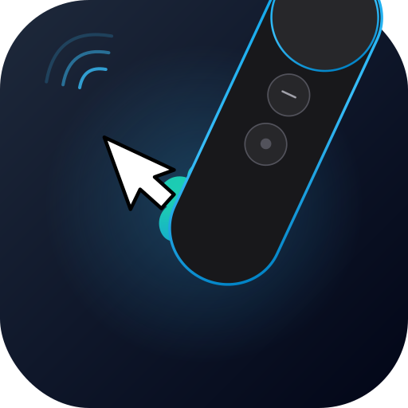

<div align="center">
  
  <h1>Daydream Air Mouse</h1>
</div>


Turn a Google Daydream controller into a wireless USB air mouse and media remote — no phone, no headset, no Google apps needed.

Uses an **ESP32-S3** board as a tiny BLE-to-USB bridge that connects to the Daydream controller over Bluetooth and presents itself as a standard USB HID mouse + media controller to any computer.

<!-- TODO: Add demo GIF/video here once available -->
<!--  -->

## Features

- **Four modes** — cycle with Home button:
  - ✈️ **Air Mouse** — point and move, gyroscope-based cursor control with EMA smoothing
  - 🖱️ **Trackpad** — use the Daydream touchpad as a mouse trackpad
  - 🎵 **Media** — swipe for next/previous track, click for play/pause, volume buttons
  - 🎮 **D-Pad** — arrow key navigation for TV-style apps (Vacuum Tube, etc.)
- **Dual controller support** — connect two Daydream controllers simultaneously
- **Adjustable sensitivity** — Home + Vol Up/Down, auto-saved to flash
- **Smart LED feedback** — breathing while scanning, solid when connected, off when sleeping
- **Auto-sleep** — stops scanning after 2 min, Boot button to wake
- **Multi-board support** — bring your own ESP32-S3 board ([add yours!](CONTRIBUTING.md))
- **T-Dongle display** — on [LilyGo T-Dongle S3](https://lilygo.cc/products/t-dongle-s3)–class dongles with an ST7735 160×80 screen, the firmware shows a small dashboard (mode, BLE, 3D controller wireframe, trackpad dot, button state)

## Resources

| Resource | Link |
|----------|------|
| 📹 Video Tutorial | *Coming soon* |
| 🖨️ 3D Printable Case | [Download on Printables](https://www.printables.com/model/1616249-xiao-esp32-s3-antenna-case-with-buttons) |
| ⚡ Web Flasher | [Flash from browser](https://delulu-delilah.github.io/d.a.m/) |
| 📖 Add Your Board | [CONTRIBUTING.md](CONTRIBUTING.md) |
| 🛒 Hardware | [Buy XIAO ESP32-S3](https://www.seeedstudio.com/XIAO-ESP32S3-p-5627.html) |
| 🧬 Inspiration | [Daydream JS](https://github.com/mrdoob/daydream-controller.js) |

## Supported Boards

| Board | Status | Notes |
|-------|--------|-------|
| [Seeed XIAO ESP32-S3](https://www.seeedstudio.com/XIAO-ESP32S3-p-5627.html) | ✅ Official | 21×17.5mm, smallest option |
| [ESP32-S3-DevKitC-1](https://www.espressif.com/en/products/devkits) | ⚠️ Untested | Espressif official dev board |
| [Adafruit QT Py ESP32-S3](https://www.adafruit.com/product/5426) | ⚠️ Untested | Compact STEMMA QT form factor |
| [LOLIN S3 Mini](https://www.wemos.cc/en/latest/s3/s3_mini.html) | ⚠️ Untested | Wemos D1 Mini form factor |
| [Unexpected Maker TinyS3](https://unexpectedmaker.com/shop/tinys3) | ⚠️ Untested | Ultra-compact, battery mgmt |
| [Waveshare ESP32-S3-Zero](https://www.waveshare.com/esp32-s3-zero.htm) | ⚠️ Untested | Budget zero form factor |
| [LilyGo T-Dongle S3](https://lilygo.cc/products/t-dongle-s3) | ⚠️ Untested | ESP32-S3 USB dongle + ST7735 160×80 TFT ([`t_dongle_s3`](platformio.ini) env, LovyanGFX dashboard) |

> **Want to add your board?** See [CONTRIBUTING.md](CONTRIBUTING.md) — any ESP32-S3 board with native USB works.

## Quick Start

### Option 1: Web Installer (recommended)

Flash directly from your browser — no downloads needed:

### **👉 [Install Firmware](https://delulu-delilah.github.io/d.a.m/)**

> Requires **Chrome** or **Edge** on desktop. Select your board, connect via USB, click Install.

### Option 2: Build from Source

Requires [PlatformIO](https://platformio.org/):

```bash
git clone https://github.com/Delulu-Delilah/d.a.m.git
cd daydream-airmouse

# Build for XIAO ESP32-S3 (default)
platformio run -e xiao_esp32s3

# LilyGo T-Dongle S3 (ST7735 160×80 — see boards/t_dongle_s3.h)
platformio run -e t_dongle_s3

# Flash
platformio run -e xiao_esp32s3 --target upload
```

## Controls

### All Modes
| Input | Action |
|-------|--------|
| Home (short press) | Cycle mode: Air Mouse → Trackpad → Media → D-Pad |
| Home (hold 1s) | Recenter orientation (air mouse) |
| App + Vol Down | Switch active controller (dual mode) |
| Home + Vol Up | Increase sensitivity (saved to flash) |
| Home + Vol Down | Decrease sensitivity (saved to flash) |

### Air Mouse & Trackpad Mode
| Input | Action |
|-------|--------|
| Trackpad click | Left click |
| App button | Right click |
| Vol Up / Vol Down | Scroll up / down |
| Trackpad swipe (air mouse) | Scroll wheel |

### Media Mode
| Input | Action |
|-------|--------|
| Trackpad click | Play / Pause |
| Swipe right | Next track |
| Swipe left | Previous track |
| App button | Mute |
| Vol Up / Vol Down | Volume up / down |

### D-Pad Mode
| Input | Action |
|-------|--------|
| Swipe up / down / left / right | Arrow keys |
| Trackpad click | Enter / Select |
| App button | Back (Escape) |
| Vol Up / Vol Down | Volume up / down |

### LED States
| Pattern | Meaning |
|---------|---------|
| 💨 Breathing | Scanning for controllers |
| 🔵 Solid | Connected |
| ⚫ Off | Sleeping (press Boot to wake) |

## Troubleshooting

<details>
<summary><strong>Controller won't connect</strong></summary>

1. **Reset the controller** — hold the Home button for **20+ seconds** until the LED blinks, then release. This clears old BLE bonds.
2. **Power cycle the ESP32** — unplug and re-plug the USB cable.
3. **Check battery** — the Daydream controller's LED should turn on when you press Home. If not, charge it via USB-C.
4. The ESP32 LED should be **breathing** (scanning). If it's off, press the Boot button to wake it.

</details>

<details>
<summary><strong>Board not detected by web flasher</strong></summary>

1. Use **Google Chrome** or **Microsoft Edge** (Safari/Firefox don't support Web Serial).
2. Try holding the **BOOT** button on the ESP32 while plugging in the USB cable — this forces download mode.
3. Make sure you're using a **data USB cable**, not a charge-only cable.
4. On macOS, check System Information → USB to verify the board appears.

</details>

<details>
<summary><strong>Mouse cursor is jittery or too fast/slow</strong></summary>

- **Adjust sensitivity** — press Home + Vol Up to increase, Home + Vol Down to decrease. Settings are saved to flash.
- **Recenter** — hold Home for 1 second to recenter the air mouse orientation.
- If the cursor drifts, recenter by long-pressing Home while the controller is stationary.

</details>

<details>
<summary><strong>No serial output in monitor</strong></summary>

The XIAO ESP32-S3 uses USB CDC for serial. After the firmware boots and starts USB HID, the serial port may re-enumerate with a different name. Try:

1. Disconnect and reconnect the USB cable
2. Check `ls /dev/cu.usb*` for the new port name
3. Use `platformio device monitor --port /dev/cu.usbmodemXXXX --rts 0 --dtr 0`

</details>

## Project Structure

```
d.a.m/
├── src/main.cpp               # Firmware (board-agnostic)
├── src/axis_display.cpp       # ST7735 UI (T-Dongle only)
├── include/                   # T-Dongle: LovyanGFX + mesh wireframe data
├── boards/                    # Board configs
│   ├── xiao_esp32s3.h         # Official board
│   ├── t_dongle_s3.h          # LilyGo T-Dongle class (ST7735)
│   └── board_template.h       # Template for new boards
├── scripts/gen_daydream_wireframe.py  # Regenerate mesh from daydream.json
├── platformio.ini             # Multi-board PlatformIO config
├── docs/                      # Web flasher (GitHub Pages)
│   ├── index.html             # Install page with board selector
│   └── boards/                # Per-board firmware + manifests
├── CONTRIBUTING.md            # How to add your board
└── README.md
```

## Credits

- Inspired by [Daydream2HID](https://github.com/ryukoposting/daydream2hid)
- Built with [NimBLE-Arduino](https://github.com/h2zero/NimBLE-Arduino) and [ESP Web Tools](https://esphome.github.io/esp-web-tools/)

## License

MIT
